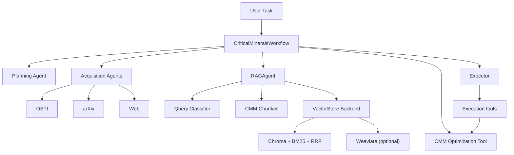

# Critical Minerals Workflow

This workflow provides an end-to-end path for Critical Minerals and Materials
(CMM) analysis with:

- local-corpus RAG,
- adaptive retrieval,
- deterministic CMM supply-chain optimization,
- final synthesis via the execution model.

## Architecture



## RAG Components

`RAGAgent` now uses CMM-specific modules:

- `src/ursa/agents/cmm_taxonomy.py`
  - commodity/subdomain tags and temporal hints.
- `src/ursa/agents/cmm_embeddings.py`
  - embedding provider abstraction (`openai`, `local`).
- `src/ursa/agents/cmm_chunker.py`
  - markdown-aware, table-preserving chunking + metadata enrichment.
- `src/ursa/agents/cmm_vectorstore.py`
  - backend abstraction:
    - `chroma`: dense + BM25 hybrid retrieval with RRF fusion,
    - `weaviate`: optional backend hook.
- `src/ursa/agents/cmm_query_classifier.py`
  - rule-based query profile for adaptive retrieval.
- `src/ursa/agents/cmm_reranker.py`
  - reranker abstraction (`none` default; `cohere`/`local` optional).

## Demo Defaults (OpenAI-only)

Set in `.env` (or start from `.env.example`):

```bash
OPENAI_API_KEY=...
OPENAI_BASE_URL=https://api.openai.com/v1

CMM_VECTORSTORE_BACKEND=chroma
CMM_EMBEDDING_MODEL=openai:text-embedding-3-large
CMM_EMBEDDING_DIMENSIONS=3072
CMM_USE_RERANKER=false
CMM_RERANKER_PROVIDER=none
CMM_HYBRID_ALPHA=0.7
```

## Workflow Input Schema

`CriticalMineralsWorkflow.invoke(...)` supports:

- `task` (required)
- `local_corpus_path`
- `rag_context`
- `source_queries`
- `optimization_input`
- `execution_instruction`

### Optimization Input

`optimization_input` expected fields:

- `commodity`: string
- `demand`: mapping `market -> quantity`
- `suppliers`: list of `{name, capacity, unit_cost, risk_score}`
- `shipping_cost` (optional): mapping `supplier -> market -> unit shipping cost`
- `risk_weight` (optional)
- `unmet_demand_penalty` (optional)
- `max_supplier_share` (optional, 0 to 1)

Output is deterministic JSON with:

- `objective_value`
- `allocations`
- `constraint_residuals`
- `feasible` / `status`
- `sensitivity_summary`

## Reindex Script

Use `scripts/reindex.py` to ingest corpus into configured backend:

```bash
uv run python scripts/reindex.py \
  --corpus-path /Users/wash198/Documents/Projects/Science_Projects/MPII_CMM/Corpus \
  --vectorstore-path cmm_vectorstore \
  --backend chroma \
  --embedding-model openai:text-embedding-3-large \
  --embedding-dimensions 3072 \
  --reset
```

The script reports indexed document/chunk counts and commodity/subdomain tag
counts.
