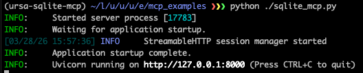

# SQLite MCP Example

This directory contains a small SQLite-backed MCP server and a simple client harness.

The goal is to provide a readable example that shows how an MCP service can expose useful tools, and how those tools can later be wired into URSA for agentic use.

## Files

- `sqlite_mcp.py`  
  MCP server that exposes a handful of SQLite tools.

- `test_sqlite_mcp.py`  
  Small hard-coded client script that connects to a running MCP server, calls its tools, and prints the results.

- `sqlite_data/`  
  Created automatically when needed. Stores the example `.db` files.

## What this example demonstrates

This example shows how to expose a few database operations through MCP:

- create a database
- create a table
- inspect tables and schema
- insert rows
- run a read-only query

It is meant to be simple and readable, not a production database service.

## Running the example

Run this from **this directory** using two terminals.

### Terminal 1: start the MCP server

```bash
python sqlite_mcp.py
```

This starts the SQLite MCP server over Streamable HTTP on: `http://127.0.0.1:8000/mcp`.

Leave this running.

### Terminal 2: run the client harness
```bash
python test_sqlite_mcp.py
```

This connects to the running MCP server, calls several of the exposed tools, and prints the results.

## Running the MCP server directly

You can run the server directly with:

```bash
python sqlite_mcp.py
```
This starts a local Streamable HTTP MCP server on port 8000.

This is useful when another client, such as URSA, will connect to the server.

## Relation to URSA

This example is a first step toward using MCP tools inside URSA.

The intended progression is:

1. verify that the MCP server works on its own
2. verify that a client can discover and call the tools
3. point URSA at this MCP server so an execution agent can use the same tools dynamically

In other words, this directory gives you a minimal local MCP example first, before adding URSA-driven agent behavior on top.

## Notes
* database files are created in sqlite_data/
* database names are normalized to use the .db suffix
* the query tool is intentionally read-only
* this example is designed for local experimentation and learning

## Expected result

A successful run of test_sqlite_mcp.py should:

1. list the available MCP tools
2. create a demo database
3. create a table
4. insert a few rows
5. query those rows back out
6. print the returned results

## Connecting This Demo Into URSA
We're going to use this prompt (or change it as you like) with the ExecutionAgent:
```
Use the sqlite_demo MCP tools to create a database called materials_demo and a table called tensile_experiments with the following columns: sample_id as a TEXT primary key, temperature_K as REAL, strain_rate_s as REAL, grain_size_um as REAL, yield_strength_MPa as REAL, and phase_label as TEXT. Then generate 100 synthetic rows of data using numpy with reasonable random distributions: temperature_K uniformly between 250 and 1200, strain_rate_s log-uniformly between 1e-4 and 1e1, grain_size_um normally distributed around 20 with a standard deviation of 5 and clipped to positive values, and yield_strength_MPa computed from a simple synthetic relationship where strength decreases with temperature, increases with strain rate, and increases slightly as grain size decreases, plus some random noise. Assign each row a sample_id from sample_001 to sample_100 and a phase_label of alpha or beta based on whether temperature_K is below or above 700. Insert all rows into the table, query the full table back out, and then plot yield_strength_MPa versus temperature_K with points colored by phase_label - save this to an appropriate PNG filename. Also print a short summary of the table contents and the fitted synthetic trends you used.
```

Let's do this using the URSA dashboard!

1. start the URSA dashboard with `ursa-dashboard` in one terminal.  Connect to it with a web browser at
   the address shown.
2. start or make sure you still have running the `sqlite_mcp` server in another terminal, `python sqlite_mcp.py`.
