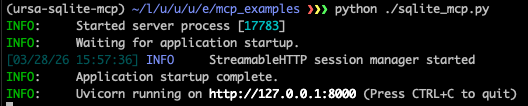
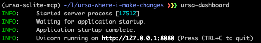
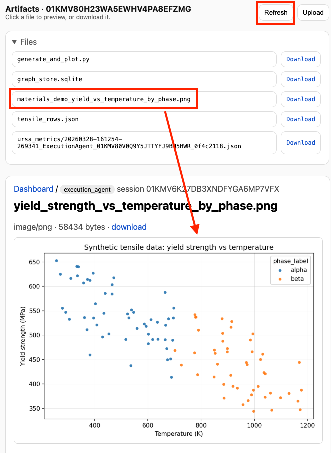

# Use SQLite tools through MCP

Start a local SQLite MCP server, verify its tools with a small Python client,
and then give those tools to an URSA execution agent in the dashboard. By the
end, the agent will create a database, generate data, and return a plot as an
artifact.

This is a local learning example, not a production database service. The server
restricts database files to `sqlite_data/` and permits only read-only queries
through its query tool.

## Prepare the example

Clone the URSA repository, open a terminal in its root, and enter this example
directory. Then let `uv` create an isolated environment and install the example,
URSA, and the dashboard.

=== "macOS/Linux"

    ```bash
    cd examples/use_mcp_tools
    uv sync
    ```

=== "Windows PowerShell"

    ```powershell
    Set-Location examples\use_mcp_tools
    uv sync
    ```

The important files are:

- [`sqlite_mcp.py`](sqlite_mcp.py), the MCP server and SQLite tools
- [`test_sqlite_mcp.py`](test_sqlite_mcp.py), a direct client that exercises
  each tool
- `sqlite_data/`, which the server creates when it stores the example databases

## Start the MCP server

Open your first terminal in this directory and start the server. Leave it
running for the rest of the walkthrough.

=== "macOS/Linux"

    ```bash
    uv run sqlite_mcp.py
    ```

=== "Windows PowerShell"

    ```powershell
    uv run sqlite_mcp.py
    ```

The server listens for Streamable HTTP connections at
`http://127.0.0.1:8000/mcp`.



## Exercise the tools directly

Open a second terminal in the same directory and run the client harness before
introducing URSA. This separates a server or tool problem from an agent
configuration problem.

=== "macOS/Linux"

    ```bash
    uv run test_sqlite_mcp.py
    ```

=== "Windows PowerShell"

    ```powershell
    uv run test_sqlite_mcp.py
    ```

The client discovers the available tools, creates `demo_test.db`, creates and
describes a table, inserts three rows, and queries them back. A successful run
ends with `Test completed successfully.`

## Connect URSA to the server

Keep the MCP server running. In the second terminal, launch the dashboard from
the example environment:

=== "macOS/Linux"

    ```bash
    uv run ursa-dashboard
    ```

=== "Windows PowerShell"

    ```powershell
    uv run ursa-dashboard
    ```

Open the address printed by the command, normally
`http://127.0.0.1:8080`. In the dashboard:

1. Open **Settings → MCP Tools**.
2. Enter `sqlite_demo` as the **Server name**.
3. Paste this server configuration:

    ```json
    {
      "transport": "streamable_http",
      "url": "http://127.0.0.1:8000/mcp"
    }
    ```

4. Select **Save**, then close Settings.
5. Create a new **Execution Agent** session and choose a disposable workspace
   or another folder you are comfortable allowing the agent to modify.



See the [MCP configuration guide](../../configuration/mcp.md) for other
transports and authenticated servers. See the
[dashboard guide](../../getting-started/dashboard.md) for credential,
workspace, and remote-access details. The broader
[configuration guide](../../configuration/index.md) explains how URSA combines
its built-in defaults, user configuration, and explicit config files.

## Ask the execution agent to use SQLite

Paste the following prompt into the new session and select **Send**:

```text
Use the sqlite_demo MCP tools to create a database called materials_demo
and a table called tensile_experiments with the following columns:
sample_id as a TEXT primary key, temperature_K as REAL, strain_rate_s as REAL,
grain_size_um as REAL, yield_strength_MPa as REAL, and phase_label as TEXT.

Then generate 100 synthetic rows of data using numpy with reasonable random
distributions: temperature_K uniformly between 250 and 1200, strain_rate_s
log-uniformly between 1e-4 and 1e1, grain_size_um normally distributed around
20 with a standard deviation of 5 and clipped to positive values, and
yield_strength_MPa computed from a simple synthetic relationship where strength
decreases with temperature, increases with strain rate, and increases slightly
as grain size decreases, plus some random noise.

Assign each row a sample_id from sample_001 to sample_100 and a phase_label
of alpha or beta based on whether temperature_K is below or above 700.

Insert all rows into the table, query the full table back out, and then plot
yield_strength_MPa versus temperature_K with points colored by phase_label.
Save this to an appropriate PNG filename.

Also print a short summary of the table contents and the fitted synthetic
trends you used.
```

Watch the MCP server terminal as the agent calls its tools. When the run
finishes, inspect the stdout summary, then open the **Artifacts** panel and
refresh it if necessary. Your numeric values will vary, but the plot should
resemble this result:



You have now tested the same MCP tools at two layers: first with a deterministic
Python client, and then through an URSA agent. Continue with the
[execution-agent guide](../../agents/execution.md) to learn how its workspace
and tool use behave, or adapt `sqlite_mcp.py` to expose tools for your own local
data source.
