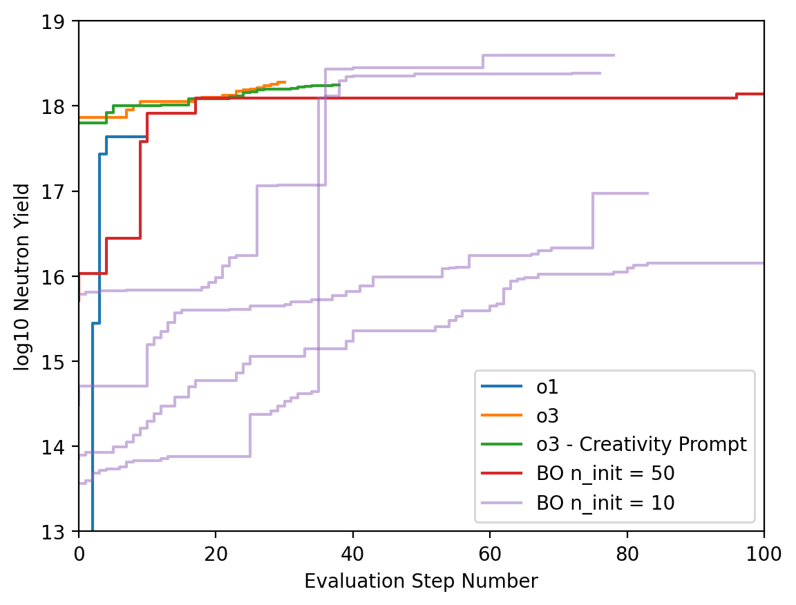
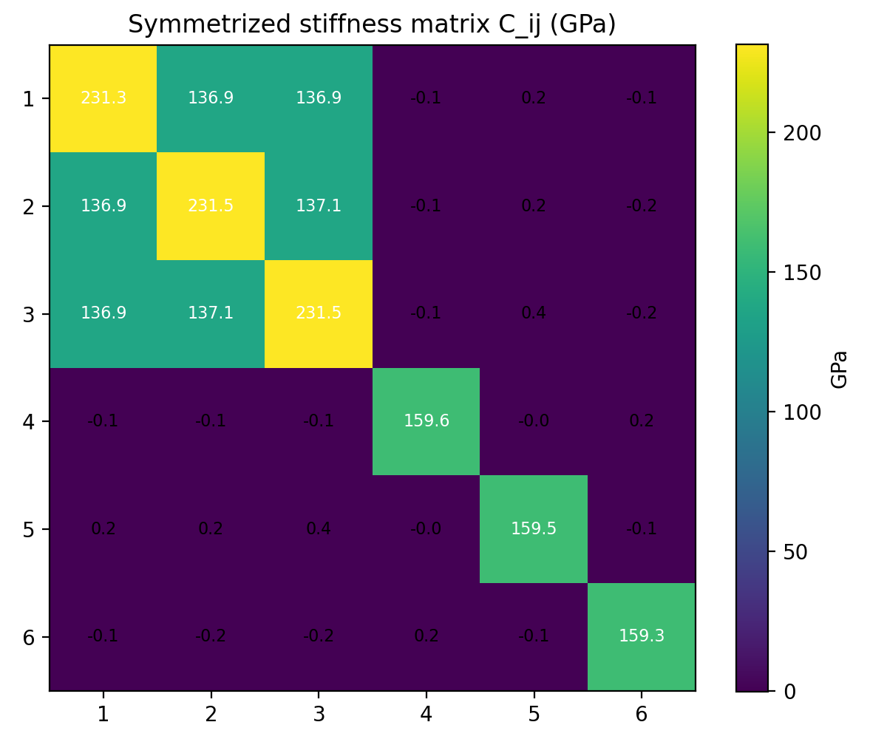

# Summary

In recent years, Large Language Models (LLMs) [@zhao2026survey] have progressed beyond their traditional role as chatbots, finding application in the automation and acceleration of a wide range of tasks. Through the use of agentic frameworks and tool integration, LLMs are increasingly being employed for software engineering, code generation, information retrieval, and complex decision-making workflows. In parallel, the application of AI agents to scientific research is receiving growing attention, with the potential to assist researchers in activities such as hypothesis generation, experimental planning, code development, data analysis, and result validation. 

Here, we present URSA (Universal Research and Scientific Agent), an open-source ecosystem of modular and extensible AI agents designed for scientific workflows. URSA provides a framework for constructing and deploying research-oriented agents that integrate domain knowledge, computational tools, and large language models. The framework supports both general-purpose scientific reasoning and the development of specialized agents tailored to domain-specific research tasks.

# Statement of need

Modern scientific research workflows involve a sequence of complex and interconnected tasks, including hypothesis generation, literature review, research planning, experiment execution, data analysis, and result validation. Depending on the scientific domain, these workflows may also require specialized capabilities such as large-scale numerical simulations, software development, code execution, and interaction with external scientific tools and databases.

URSA has been designed to support this broad range of activities through a composable system of collaborating agents. A central goal of the project is to provide a unified framework that can support as much of the scientific research lifecycle as possible while remaining flexible enough to accommodate domain-specific requirements. For a given scientific problem, URSA can:

* Decompose high-level objectives into executable tasks.
* Execute those tasks through interactions with external tools and services.
* Validate and refine results using scientific literature and external knowledge sources.

Many scientific workflows additionally require domain-specific capabilities, such as running simulation codes on high-performance computing (HPC) resources. URSA's modular architecture enables the construction of specialized agents by composing its core planning, execution, and validation components. The current codebase includes several examples of such agents, including:

* Agents for interacting with scientific simulation codes using user-provided documentation and domain-specific knowledge.
* Agents specialized for molecular dynamics simulations that aid in the design of novel materials.
* Agents for optimization and inverse-design problems.

In addition to the agents provided with the framework, users can create their own specialized agents by composing existing URSA components with domain-specific tools, knowledge sources, and workflows. By combining scientific reasoning, tool use, and domain-specific workflows within a common architecture, URSA aims to provide a comprehensive yet extensible framework for AI-assisted scientific research.

# State of the field                                                                                                                  

Some of the most widely used agentic systems include Claude Code [@claude_code] and Codex [@codex]. These coding-focused agents have demonstrated the ability of LLM-based systems to support software engineering workflows, including repository exploration, code generation, debugging, code execution, and iterative software development. By combining language models with tool use and execution environments, these systems have shown that AI agents can autonomously perform complex multi-step tasks that traditionally required significant human effort. However, while such systems are highly effective for software engineering tasks, scientific research often requires additional capabilities, including literature review, domain-specific reasoning, interaction with scientific software, large-scale simulations, and specialized validation procedures.

Several agentic systems have also been developed specifically for scientific research, including Sakana AI's AI Scientist [@lu2024ai], Google's Co-Scientist [@gottweis2026accelerating], SciAgents [@ghafarollahi2025sciagents], Agent Laboratory [@schmidgall2025agent], and OpenAI's Deep Research [@openai_deep_research_2025]. While these systems demonstrate the potential of AI-assisted scientific discovery, many are designed as end-to-end research assistants or focus on specific research tasks. In contrast, URSA emphasizes extensibility and composition, enabling users to construct customized scientific workflows and specialized agents that integrate domain knowledge, scientific software, simulation codes, and computational resources.

# Software design

URSA is built on top of LangGraph [@langgraph] and is agnostic to the underlying large language model. Its software architecture is organized around three main concepts: (i) reusable core and domain-specific agents, (ii) multiple user interfaces that expose a common execution engine, and (iii) execution environments that orchestrate collaboration among multiple agents.

## Agent Framework

URSA's agents are organized around a collection of core agents that support general scientific workflows and serve as building blocks for the construction of domain-specific agents. This design enables the same architectural components to be reused across a wide range of scientific applications.

### Core Agents

URSA's core agents include, but are not limited to, the following:

* Planning Agent: This agent decomposes a user-specified scientific problem into a sequence of executable tasks. Implemented as a LangGraph workflow, it consists of three LLM-driven nodes: a planner node that generates an initial research plan, a reviewer node that evaluates and iteratively refines the plan, and a formalizer node that converts the approved plan into a structured JSON representation. This structured output can then be passed to downstream agents, such as the Execution Agent.

* Execution Agent: This agent carries out research tasks specified either in natural language or in the structured JSON format produced by the Planning Agent. It interacts with tools through LangGraph tool calls and through the Model Context Protocol (MCP), allowing virtually any user-provided executable to be incorporated into agent workflows. The Execution Agent also includes built-in tools for code generation and execution, file reading and writing, and system command execution. To improve safety, proposed system commands are screened by an LLM-driven safety node before execution.

<!--
* ArXiv Agent: This agent supports literature-review by searching, downloading, and analyzing papers from the arXiv repository. Given a user query, it uses the arXiv search API to identify relevant papers and constructs a retrieval-augmented generation (RAG) database for each paper using a user-specified embedding model. LLM-backed nodes then generate summaries of the individual papers. When the underlying LLM supports multimodal input, the agent can summarize both textual content and figures from the papers. A final aggregator node synthesizes the individual summaries into a report tailored to the user's query.
-->

### Domain-Specific Agents

URSA allows for the construction of highly domain-specific agents that can fit into the bigger URSA ecosystem in a natural manner. As examples, we discuss two specific agents

* Simulation Agent: The Simulation Agent supports the use of computationally intensive simulation codes on high-performance computing (HPC) resources. The agent is also capable of handling their compilation, execution, debugging, and analysis. Rather than implementing simulation-specific functionality from scratch, this agent is constructed by orchestrating multiple instances of the core Execution Agent within a LangGraph workflow. One execution agent is responsible for documentation and knowledge acquisition, while another is responsible for simulation setup, execution, debugging, and analysis. The documentation stage gathers information from user-provided manuals, web resources, scientific literature, and RAG-based knowledge bases to construct a task-specific user guide. This guide is then passed to the simulation stage, which uses it to configure and execute simulation campaigns, analyze outputs, and iteratively resolve execution failures. A final summarization stage synthesizes the results of the workflow.

* LAMMPS Agent: The LAMMPS Agent [@somasundaram] is a domain-specific agent for atomistic simulations built on top of the URSA framework. The agent is capable of autonomously orchestrating the full lifecycle of a molecular dynamics simulation, including interatomic potential selection, generation of LAMMPS input scripts, simulation execution, iterative error recovery, and post-processing of results. The agent can operate in a highly autonomous mode requiring only a natural-language description of the desired simulation, or in an expert mode where users can provide simulation templates, interatomic potentials, and other domain-specific inputs. A key feature of the agent is its ability to iteratively refine simulation inputs in response to execution failures and to leverage other agents within the URSA ecosystem for tasks such as visualization, literature review, and validation against published results.

* Optimization Agent: The Optimization Agent is a self-contained LangGraph workflow for formulating and solving optimization and inverse-design problems from natural-language input. The agent first extracts the optimization problem, converts it into a structured mathematical representation, and optionally discretizes the problem when infinite-dimensional variables or constraints are detected. It then selects an appropriate solver, generates executable optimization code, runs feasibility checks using a dedicated tool, verifies the resulting formulation, and produces a final explanation of the solution. If verification fails, the workflow loops back to the problem-extraction stage, allowing the agent to iteratively revise the formulation. Unlike the Simulation Agent, the Optimization Agent is not built by composing multiple URSA agents, but it follows the same graph-based design philosophy and can be incorporated into larger URSA workflows.


## User Interfaces

URSA's framework is exposed through multiple interfaces that target different scientific workflows while sharing the same underlying engine. Users may interact with URSA through a command-line interface, a web dashboard, or directly through the Python API. Regardless of the interface, the same underlying LangGraph workflows, agent definitions, tools, and model configurations are used.

### Command-Line Interface

The command-line interface (CLI) provides an interactive REPL for executing agents and composing scientific workflows. A typical session is launched using

```bash
ursa --config config.yaml
```

where the YAML configuration specifies the desired language model and runtime options. Within the REPL, users can invoke individual agents using commands such as

```text
ursa> plan Write a workflow for computing elastic constants.
ursa> execute Execute the plan.
```

or interact directly with the underlying language model. Because the CLI shares the same backend as the Python API, workflows developed interactively can later be embedded into automated scripts with minimal modification.

### Web Dashboard

URSA also provides a browser-based dashboard that exposes the same agent capabilities through a graphical interface. After installing the optional dashboard dependencies, the server can be started with

```bash
ursa-dashboard
```

or configured explicitly, for example,

```bash
ursa-dashboard --host 127.0.0.1 --port 8080
```

The dashboard enables users to configure agents, manage conversations, inspect intermediate outputs, and execute scientific workflows without requiring command-line interaction while relying on the same backend infrastructure as the CLI.

### Python Interface

For integration into scientific software, URSA can be imported directly as a Python package. Agents may be instantiated, configured, and executed within Python scripts or Jupyter notebooks. A typical workflow consists of creating an agent instance and invoking it with a natural-language task:

```python
from langchain.chat_models import init_chat_model
from langchain_core.messages import HumanMessage

from ursa.agents import ExecutionAgent

llm = init_chat_model(model="openai:gpt-5.4")
agent = ExecutionAgent(llm=llm)

result = agent.invoke({
    "messages": [
        HumanMessage(
            content="Write and run a Python script that prints the first 10 prime numbers."
        )
    ],
    "workspace": "./ursa-script-workspace",
})

print(result["messages"][-1].content)
```

The Python interface is particularly useful for integration with existing simulation codes, analysis pipelines, and high-performance computing workflows. It also provides the foundation for constructing new domain-specific agents by composing existing URSA components with custom tools, language models, and LangGraph workflows.


## Agent Execution Environments

URSA provides execution environments for composing multiple agents into larger scientific workflows. These environments define how agents exchange information and coordinate their execution while reusing the same underlying agent implementations. By separating agent behavior from orchestration, users can construct reusable workflows that combine planning, execution, literature review, simulation, and other domain-specific capabilities. Additional examples of these environments are provided in the URSA documentation: https://lanl.github.io/ursa/.

### Agent Teams

The Agent Teams environment allows multiple agents to collaborate on a common task by passing information between one another. Each agent performs a specific role within the workflow—for example, retrieving scientific literature, executing code, or analyzing results—before forwarding its output to downstream agents. This enables complex scientific workflows to be constructed by composing specialized agents into a single execution graph.

The URSA documentation includes several examples of this execution model, including workflows that combine an ArXiv Agent with an Execution Agent for materials science and neutron star applications. These examples illustrate how the output of one agent can be used as input to another, enabling modular and reusable scientific pipelines. See https://lanl.github.io/ursa/ for additional examples.

### Agent Symposia

The Agent Symposia environment enables multiple agents to independently analyze the same scientific problem before discussing their conclusions in a structured peer-review process. Rather than assigning distinct tasks to different agents, each participant develops its own solution or recommendation, critiques the responses of the other participants, and iteratively refines its reasoning. The final response is then synthesized from the discussion.

This environment is particularly well suited for scientific tasks that benefit from multiple independent perspectives, such as research planning, hypothesis generation, or evaluation of competing approaches. Additional examples and usage instructions are available in the URSA documentation: https://lanl.github.io/ursa/.

# Research impact statement

URSA is actively used in a growing number of scientific research applications, averaging ~1500 downloads a month on PyPI. While the framework was initially developed at Los Alamos National Laboratory, it is distributed as open-source software and is intended to support contributions and adoption by the broader scientific community.

As one example, \autoref{fig:helios} shows the use of URSA in the design of inertial confinement fusion (ICF) capsules. In this workflow, URSA's planning and execution agents were used to autonomously explore candidate designs and optimize neutron yield. More details of this application can be found in @grosskopf2025ursa.



As a second example, \autoref{fig:lammps} shows atomistic calculations performed by URSA's LAMMPS Agent for a high-entropy alloy. Such calculations are commonly employed in computational materials science to predict material properties and guide the design of novel materials. More details of the LAMMPS Agent can be found in [@somasundaram].



These examples illustrate the breadth of scientific domains in which URSA can be applied, ranging from optimization-driven design problems to large-scale simulation and materials modeling workflows.

# AI usage disclosure

This work is on AI-driven agentic workflows, so LLMs are invoked at multiple instances within URSA. For example, LLMs were involved in the generation of \autoref{fig:helios} and \autoref{fig:lammps}. For the writing of this manuscript, LLMs were used only for minor polishing, such as grammar and spell checks. All LLM generated text was critically reviewed by the authors for accuracy.

# Acknowledgements

This work was supported by the Laboratory Directed Research and Development program of Los Alamos National Laboratory under project number 20250638DI. This research used resources provided by the Los Alamos National Laboratory Institutional Computing Program, which is supported by the U.S. Department of Energy National Nuclear Security Administration under Contract No. 89233218CNA000001.

# References
